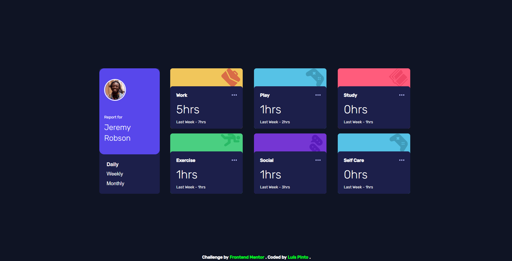

# Time Tracking Dashboard

# 

A challenge made for Frontend Mentor.

> Check it out: [https://FlashCodX.github.io/time-tracking-dashboard/](https://FlashCodX.github.io/time-tracking-dashboard/)

## Tech

- [React] - HTML enhanced for web apps!
- [Redux] - A global state management.
- [CSS Modules] - Used to prevent class overlap.

## License

MIT

**Free Software, Hell Yeah!**

[react]: https://reactjs.org/

[reacticons] - https://react-icons.github.io/react-icons/
[redux] - https://redux.js.org/
